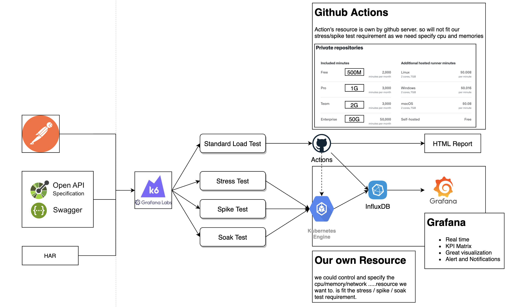

## Load Testing demo / 负载测试Demo

EN:
* Based on: K6/k6-reporter + influxDB + Grafana 
* Code: includes smoke/spike/stress/soak testing (come from k6.io)
* Visualization: Html report / influxDB + Grafana 

CN：
* 基于 K6 + influxDB + Grafana
* Demo 代码包含 冒烟/峰值/压力/浸泡 测试. (来自k6.io)
* 展示方式： influxDB + grafana

#### Env support / 环境
* Docker 
* K8s (TODO)

### Ref
* https://k6.io 
* https://github.com/luketn/docker-k6-grafana-influxdb
* https://github.com/benc-uk/k6-reporter
